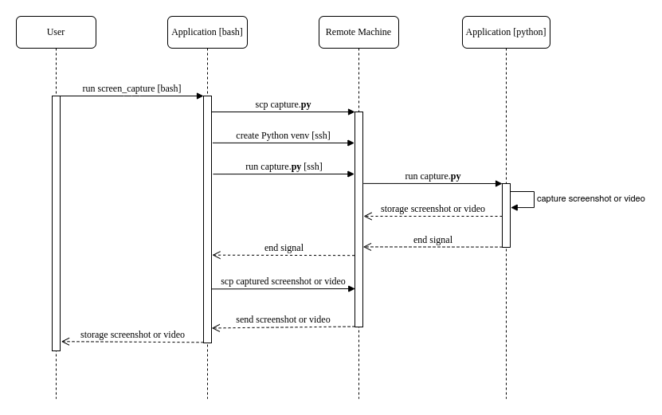
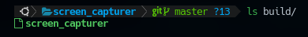

[](https://github.com/prettier/prettier)

# Screen capture application

Application to capture the screen as screenshots or videos remotely using Python, Bash, ssh and [Makeselft](https://makeself.io/).

# Table of contents

* [Overview](#overview)
* [Get started](#get-started)
  * [Build](#build)
  * [Installation](#installation)
  * [Run](#run)
* [Static code analysis tools](#static-code-analysis-tools)
  * [Find Problems](#find-problems)
* [License](#license)

# Overview

System flow:



# Get Started

## Build

```bash
bash scripts/build.sh
```

The generated application is stored in the `build/` directory.



## Installation

Install the application on your system (`/usr/bin/`).

```bash
bash scripts/install.sh
```

## Run

### Capture video and install dependencies

```bash
bash screen_capturer -- -h "<DEVICE_IP>" -i
```

### Capture video

```bash
bash screen_capturer -- -h "<DEVICE_IP>"
```

### Capture screenshot

```bash
bash screen_capturer -- -h "<DEVICE_IP>" -m s
```
